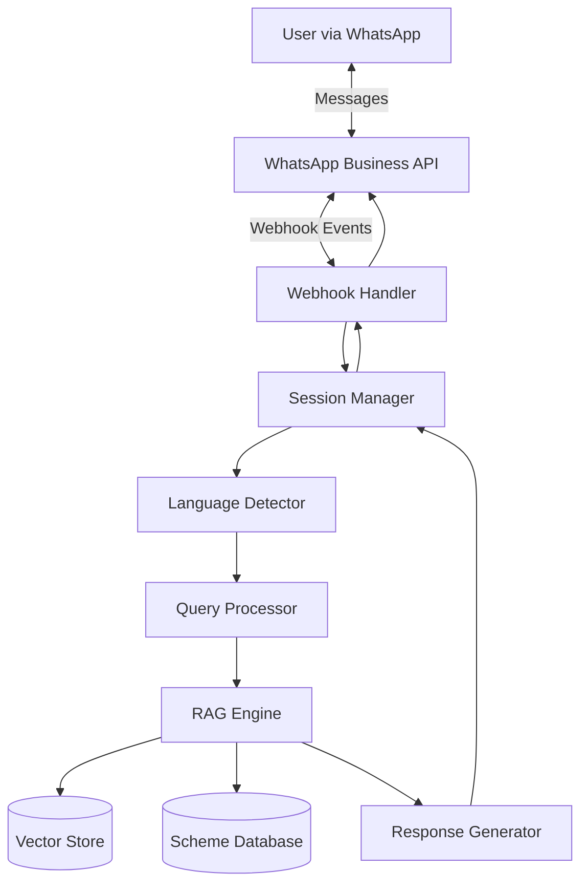

# Design Document: Y-Connect WhatsApp Bot

## Overview

Y-Connect is a WhatsApp-based conversational AI system that helps Indian citizens discover government schemes using natural language queries in their preferred language. The system employs a Retrieval-Augmented Generation (RAG) architecture to ensure accurate, factual responses grounded in official government scheme documentation.

The architecture consists of five main layers:
1. **Communication Layer**: WhatsApp Business API integration for message handling
2. **Language Processing Layer**: Multi-language detection and translation
3. **RAG Layer**: Vector-based retrieval and LLM-based generation
4. **Data Layer**: Scheme database and vector store
5. **Session Management Layer**: User context and conversation state

## Architecture

### High-Level Architecture



### Technology Stack

- **WhatsApp Integration**: WhatsApp Business API (Cloud API or On-Premises)
- **Backend Framework**: Python with FastAPI for webhook handling
- **Language Detection**: fastText or langdetect library
- **Vector Database**: Pinecone, Weaviate, or Qdrant for embeddings storage
- **Embeddings Model**: multilingual-e5-large or sentence-transformers for multi-language support
- **LLM**: GPT-4, Claude, or open-source alternatives (Llama 2, Mistral) with multi-language capabilities
- **Database**: PostgreSQL for scheme metadata and user sessions
- **Caching**: Redis for session management and rate limiting
- **Message Queue**: RabbitMQ or AWS SQS for async processing

## Components and Interfaces

### 1. Webhook Handler

**Responsibility**: Receives and validates incoming WhatsApp messages, routes to appropriate handlers.

**Interface**:
```python
class WebhookHandler:
    def handle_message(webhook_payload: dict) -> Response:
        """
        Process incoming WhatsApp webhook events
        
        Args:
            webhook_payload: Raw webhook data from WhatsApp API
            
        Returns:
            HTTP 200 response to acknowledge receipt
        """
        
    def verify_webhook(mode: str, token: str, challenge: str) -> Response:
        """
        Verify webhook during initial setup
        
        Args:
            mode: Verification mode
            token: Verification token
            challenge: Challenge string to echo back
            
        Returns:
            Challenge string if verification succeeds
        """
```

**Key Operations**:
- Validate webhook signature using WhatsApp app secret
- Extract message content, sender phone number, and message type
- Route to SessionManager for processing
- Handle webhook verification during setup

### 2. Session Manager

**Responsibility**: Maintains conversation context for each user, manages session lifecycle.

**Interface**:
```python
class SessionManager:
    def get_or_create_session(phone_number: str) -> UserSession:
        """
        Retrieve existing session or create new one
        
        Args:
            phone_number: User's WhatsApp phone number
            
        Returns:
            UserSession object with conversation history
        """
        
    def update_session(session_id: str, message: Message, response: str) -> None:
        """
        Update session with new message and response
        
        Args:
            session_id: Unique session identifier
            message: User's message
            response: Bot's response
        """
        
    def clear_expired_sessions() -> int:
        """
        Remove sessions inactive for >24 hours
        
        Returns:
            Number of sessions cleared
        """
```

**Data Model**:
```python
class UserSession:
    session_id: str
    phone_number: str
    language: str
    conversation_history: List[Message]
    user_context: dict  # Extracted entities (age, location, occupation, etc.)
    created_at: datetime
    last_active: datetime
    is_new_user: bool
```

**Storage**: Redis with 24-hour TTL for active sessions

### 3. Language Detector

**Responsibility**: Identifies the language of incoming messages.

**Interface**:
```python
class LanguageDetector:
    def detect_language(text: str) -> LanguageResult:
        """
        Detect language of input text
        
        Args:
            text: User's message text
            
        Returns:
            LanguageResult with detected language code and confidence
        """
        
    def is_supported_language(lang_code: str) -> bool:
        """
        Check if language is supported
        
        Args:
            lang_code: ISO 639-1 language code
            
        Returns:
            True if language is supported
        """
```

**Data Model**:
```python
class LanguageResult:
    language_code: str  # ISO 639-1 code (hi, en, ta, etc.)
    language_name: str  # Full name (Hindi, English, Tamil, etc.)
    confidence: float   # Detection confidence (0.0 to 1.0)
```

**Supported Languages**: Hindi (hi), English (en), Tamil (ta), Telugu (te), Bengali (bn), Marathi (mr), Gujarati (gu), Kannada (kn), Malayalam (ml), Punjabi (pa)

**Implementation**: Use fastText language identification model trained on Indian languages

### 4. Query Processor

**Responsibility**: Extracts intent and entities from user queries, maintains conversation context.

**Interface**:
```python
class QueryProcessor:
    def process_query(text: str, session: UserSession) -> ProcessedQuery:
        """
        Process user query and extract structured information
        
        Args:
            text: User's message text
            session: Current user session with context
            
        Returns:
            ProcessedQuery with intent, entities, and context
        """
        
    def extract_entities(text: str, language: str) -> dict:
        """
        Extract entities like age, location, occupation, income
        
        Args:
            text: User's message text
            language: Detected language code
            
        Returns:
            Dictionary of extracted entities
        """
```

**Data Model**:
```python
class ProcessedQuery:
    original_text: str
    language: str
    intent: str  # search_schemes, get_details, help, feedback
    entities: dict  # {age: int, location: str, occupation: str, category: str}
    needs_clarification: bool
    clarification_questions: List[str]
    search_vector: List[float]  # Embedding for semantic search
```

**Entity Types**:
- **age**: Integer or age group (youth, senior)
- **location**: State, district, or "all India"
- **occupation**: Farmer, student, entrepreneur, unemployed, etc.
- **income**: Income bracket or BPL status
- **category**: SC/ST/OBC/General
- **gender**: Male/Female/Other
- **scheme_category**: Agriculture, education, health, housing, etc.

### 5. RAG Engine

**Responsibility**: Core retrieval and generation logic for scheme information.

**Interface**:
```python
class RAGEngine:
    def retrieve_schemes(query: ProcessedQuery, top_k: int = 5) -> List[SchemeDocument]:
        """
        Retrieve relevant schemes using semantic search
        
        Args:
            query: Processed query with embeddings
            top_k: Number of top results to retrieve
            
        Returns:
            List of relevant scheme documents with similarity scores
        """
        
    def generate_response(
        query: ProcessedQuery,
        retrieved_docs: List[SchemeDocument],
        language: str
    ) -> GeneratedResponse:
        """
        Generate natural language response using LLM
        
        Args:
            query: User's processed query
            retrieved_docs: Retrieved scheme documents
            language: Target language for response
            
        Returns:
            Generated response with sources
        """
        
    def rerank_results(
        query: ProcessedQuery,
        candidates: List[SchemeDocument]
    ) -> List[SchemeDocument]:
        """
        Rerank retrieved documents based on user context
        
        Args:
            query: Processed query with user context
            candidates: Initial retrieved documents
            
        Returns:
            Reranked list of documents
        """
```

**RAG Pipeline**:
1. **Query Embedding**: Convert processed query to vector using multilingual embedding model
2. **Semantic Search**: Query vector store for top-k similar scheme documents
3. **Reranking**: Apply user context filters (location, eligibility) to rerank results
4. **Context Assembly**: Combine retrieved documents into LLM context
5. **Generation**: Generate response in target language with citations
6. **Post-processing**: Format response for WhatsApp (character limits, structure)

**Prompt Template**:
```
You are Y-Connect, a helpful assistant that provides information about Indian government schemes.

User Query: {query}
User Context: {user_context}
Language: {language}

Retrieved Schemes:
{scheme_documents}

Instructions:
1. Answer the user's question based ONLY on the retrieved schemes
2. Respond in {language}
3. Include scheme names and official links
4. Structure response with clear sections: Eligibility, Benefits, How to Apply
5. If multiple schemes match, provide a summary list
6. Keep response under 1600 characters
7. Be conversational and helpful

Response:
```

### 6. Vector Store

**Responsibility**: Stores and retrieves scheme document embeddings for semantic search.

**Schema**:
```python
class VectorDocument:
    id: str  # Unique scheme ID
    vector: List[float]  # 1024-dim embedding
    metadata: dict  # {
        scheme_name: str,
        scheme_name_local: str,  # Name in regional language
        category: str,
        authority: str,  # Central/State government
        state: str,  # Applicable state or "All India"
        status: str,  # active/expired
        last_updated: datetime,
        language: str  # Language of the document chunk
    }
    text_chunk: str  # Original text that was embedded
```

**Indexing Strategy**:
- Create separate embeddings for each language version of scheme documents
- Chunk large documents into 512-token segments with 50-token overlap
- Store metadata for filtering (state, category, status)
- Use HNSW index for fast approximate nearest neighbor search

**Operations**:
- `upsert_documents(documents: List[VectorDocument])`: Add or update embeddings
- `search(query_vector: List[float], filters: dict, top_k: int)`: Semantic search with metadata filters
- `delete_by_id(scheme_id: str)`: Remove scheme embeddings

### 7. Scheme Database

**Responsibility**: Stores structured scheme information and metadata.

**Schema**:
```sql
CREATE TABLE schemes (
    scheme_id VARCHAR(100) PRIMARY KEY,
    scheme_name VARCHAR(500) NOT NULL,
    scheme_name_translations JSONB,  -- {hi: "...", ta: "...", etc.}
    description TEXT,
    description_translations JSONB,
    category VARCHAR(100),  -- agriculture, education, health, etc.
    authority VARCHAR(100),  -- central, state_name
    applicable_states TEXT[],  -- Array of state codes or ['ALL']
    eligibility_criteria JSONB,  -- Structured eligibility rules
    benefits TEXT,
    benefits_translations JSONB,
    application_process TEXT,
    application_process_translations JSONB,
    official_url VARCHAR(500),
    helpline_numbers TEXT[],
    status VARCHAR(20),  -- active, expired, upcoming
    start_date DATE,
    end_date DATE,
    last_updated TIMESTAMP,
    source_document_url VARCHAR(500),
    created_at TIMESTAMP DEFAULT NOW()
);

CREATE INDEX idx_schemes_category ON schemes(category);
CREATE INDEX idx_schemes_status ON schemes(status);
CREATE INDEX idx_schemes_states ON schemes USING GIN(applicable_states);

CREATE TABLE scheme_documents (
    document_id VARCHAR(100) PRIMARY KEY,
    scheme_id VARCHAR(100) REFERENCES schemes(scheme_id),
    language VARCHAR(10),
    content TEXT,
    document_type VARCHAR(50),  -- overview, eligibility, benefits, application
    created_at TIMESTAMP DEFAULT NOW()
);
```

**Operations**:
- `get_scheme_by_id(scheme_id: str)`: Retrieve full scheme details
- `search_schemes(filters: dict)`: Filter schemes by category, state, status
- `get_scheme_translations(scheme_id: str, language: str)`: Get localized content
- `update_scheme(scheme_id: str, updates: dict)`: Update scheme information

### 8. Response Generator

**Responsibility**: Formats LLM output for WhatsApp delivery, handles message splitting.

**Interface**:
```python
class ResponseGenerator:
    def format_response(
        generated_text: str,
        schemes: List[SchemeDocument],
        language: str
    ) -> List[WhatsAppMessage]:
        """
        Format response for WhatsApp delivery
        
        Args:
            generated_text: LLM-generated response
            schemes: Source schemes for citations
            language: Target language
            
        Returns:
            List of WhatsApp messages (split if needed)
        """
        
    def create_scheme_summary(schemes: List[SchemeDocument], language: str) -> str:
        """
        Create summary list when multiple schemes match
        
        Args:
            schemes: List of matching schemes
            language: Target language
            
        Returns:
            Formatted summary with numbered list
        """
        
    def create_welcome_message(language: str) -> str:
        """
        Generate welcome message for new users
        
        Args:
            language: User's preferred language
            
        Returns:
            Localized welcome message
        """
```

**Formatting Rules**:
- Maximum 1600 characters per message
- Use Unicode emoji for visual appeal (✅, 📋, 🔗)
- Structure with clear sections using line breaks
- Include clickable links for official websites
- Number multiple schemes for easy reference
- Add "Reply with number for details" for scheme lists

**Message Templates**:

Welcome Message:
```
🙏 Welcome to Y-Connect!

I help you find government schemes in your language.

Try asking:
• "Show me farmer schemes"
• "Education schemes for girls"
• "Senior citizen benefits"

Type 'help' anytime for guidance.
```

Scheme Details:
```
📋 {Scheme Name}

✅ Eligibility:
{eligibility_points}

💰 Benefits:
{benefits_points}

📝 How to Apply:
{application_steps}

🔗 Official Link: {url}
📞 Helpline: {phone}
```

Multiple Schemes:
```
Found {count} schemes for you:

1. {Scheme 1 Name}
   {One-line description}

2. {Scheme 2 Name}
   {One-line description}

Reply with number (1-{count}) for full details.
```

## Data Models

### Message Flow Data Model

```python
class IncomingMessage:
    message_id: str
    from_phone: str
    timestamp: datetime
    message_type: str  # text, image, audio, video
    text_content: str
    media_url: Optional[str]

class OutgoingMessage:
    to_phone: str
    message_type: str  # text, template
    text_content: str
    reply_to_message_id: Optional[str]

class Message:
    role: str  # user, assistant
    content: str
    timestamp: datetime
    language: str
```

### Scheme Data Model

```python
class Scheme:
    scheme_id: str
    scheme_name: str
    scheme_name_translations: dict  # {lang_code: translated_name}
    description: str
    description_translations: dict
    category: str
    authority: str
    applicable_states: List[str]
    eligibility_criteria: dict
    benefits: str
    benefits_translations: dict
    application_process: str
    application_process_translations: dict
    official_url: str
    helpline_numbers: List[str]
    status: str
    start_date: date
    end_date: Optional[date]
    last_updated: datetime

class SchemeDocument:
    document_id: str
    scheme_id: str
    scheme: Scheme
    language: str
    content: str
    document_type: str
    similarity_score: float  # From vector search
```

## Correctness Properties

*A property is a characteristic or behavior that should hold true across all valid executions of a system—essentially, a formal statement about what the system should do. Properties serve as the bridge between human-readable specifications and machine-verifiable correctness guarantees.*


### Property 1: Message Processing Time Bound
*For any* user message, the system should receive and begin processing within 5 seconds of webhook receipt.
**Validates: Requirements 1.1**

### Property 2: WhatsApp API Integration
*For any* generated response, the system should successfully call the WhatsApp API with correct parameters (recipient phone number, message content, message type).
**Validates: Requirements 1.2**

### Property 3: Multimedia Message Handling
*For any* non-text message (image, audio, video), the system should respond with an acknowledgment message instructing the user to use text queries.
**Validates: Requirements 1.3**

### Property 4: Session Isolation
*For any* set of concurrent user sessions, messages and context from one session should never appear in another session's conversation history or responses.
**Validates: Requirements 1.4**

### Property 5: Session Expiration and Privacy
*For any* user session inactive for 24 hours or more, all session data including conversation history and user context should be deleted from storage.
**Validates: Requirements 1.5, 8.2**

### Property 6: Language Detection Accuracy
*For any* message in a supported language, the language detector should identify the correct language with at least 90% accuracy across a diverse test set.
**Validates: Requirements 2.2**

### Property 7: Response Language Consistency
*For any* user query in language L, the generated response should be in the same language L, including when users switch languages mid-conversation.
**Validates: Requirements 2.3, 2.4, 2.5**

### Property 8: Entity Extraction Completeness
*For any* query containing entities (age, income, occupation, location, category), the Query Processor should extract all present entities with their correct values.
**Validates: Requirements 3.1**

### Property 9: Ambiguity Handling
*For any* ambiguous query that could match multiple scheme categories, the system should respond with clarifying questions rather than making assumptions.
**Validates: Requirements 3.2**

### Property 10: Context-Aware Retrieval
*For any* query with user context (e.g., "I am a farmer in Punjab"), retrieved schemes should match the specified context constraints (occupation=farmer, location=Punjab).
**Validates: Requirements 3.3**

### Property 11: Spelling Error Robustness
*For any* query with common spelling errors or colloquial variations, the system should extract the same intent as the correctly spelled version.
**Validates: Requirements 3.4**

### Property 12: Conversation Context Persistence
*For any* multi-turn conversation, entities and context mentioned in earlier messages should be available and used in processing later messages within the same session.
**Validates: Requirements 3.5**

### Property 13: Retrieval Result Count
*For any* query, the RAG Engine should retrieve at most 5 scheme documents from the vector store (or fewer if the database contains fewer than 5 schemes).
**Validates: Requirements 4.1**

### Property 14: Response Grounding
*For any* factual claim in a generated response, the information should be present in at least one of the retrieved source documents.
**Validates: Requirements 4.2**

### Property 15: Low Confidence Handling
*For any* query where all retrieved schemes have similarity scores below 0.7, the system should inform the user that no relevant schemes were found and suggest broadening the query.
**Validates: Requirements 4.3**

### Property 16: Active Scheme Prioritization
*For any* query that matches both active and expired schemes, active schemes should rank higher in the results than expired schemes with similar relevance scores.
**Validates: Requirements 4.5**

### Property 17: Embedding Update Propagation
*For any* scheme update in the database, subsequent vector searches should reflect the updated information within 1 hour.
**Validates: Requirements 5.2, 5.3**

### Property 18: Response Structure Completeness
*For any* scheme detail response, the message should contain all required sections (scheme name, eligibility, benefits, application process, official URL, helpline) and source citations.
**Validates: Requirements 6.1, 6.3, 4.4**

### Property 19: Multi-Scheme Summary Format
*For any* query that retrieves multiple schemes, the response should present a numbered summary list with an option to get details on specific schemes.
**Validates: Requirements 6.2**

### Property 20: Message Length Constraint
*For any* generated response, each individual message should be at most 1600 characters in length.
**Validates: Requirements 6.4**

### Property 21: Logical Message Splitting
*For any* response content exceeding 1600 characters, the system should split it into multiple messages at logical boundaries (section breaks, sentence boundaries) rather than mid-sentence.
**Validates: Requirements 6.5**

### Property 22: Help Command Multi-Language
*For any* help command keyword ("help", "मदद", "உதவி", etc.) in any supported language, the system should respond with usage instructions in that language.
**Validates: Requirements 7.2**

### Property 23: Category Filtering
*For any* category selection (agriculture, education, health, etc.), all returned schemes should belong to the selected category.
**Validates: Requirements 7.4**

### Property 24: PII Deletion After Session Expiry
*For any* expired session, no personally identifiable information (phone numbers, extracted personal details) should remain in any storage system.
**Validates: Requirements 8.1, 8.2**

### Property 25: Third-Party Data Isolation
*For any* query processing, no user data (phone numbers, message content, extracted entities) should be sent to endpoints outside the approved system components.
**Validates: Requirements 8.4**

### Property 26: Log Anonymization
*For any* logged event, the log entry should not contain phone numbers or other PII in plain text (should be hashed or redacted).
**Validates: Requirements 8.5**

### Property 27: API Retry Logic
*For any* WhatsApp API call that fails, the system should retry up to 3 times with exponential backoff before marking the message as failed.
**Validates: Requirements 9.4**

### Property 28: Error Message Sanitization
*For any* system error, the user-facing error message should not contain stack traces, internal component names, or technical implementation details.
**Validates: Requirements 9.5**

### Property 29: Response Time SLA
*For any* set of 100 user queries under normal load, at least 95 queries should receive a response within 10 seconds.
**Validates: Requirements 10.1, 10.2**

### Property 30: Concurrent Session Handling
*For any* load test with 100 concurrent user sessions, the system should maintain response times within the 10-second SLA without errors.
**Validates: Requirements 10.4**

### Property 31: Overload Queue Management
*For any* request received when system load exceeds capacity, the request should be queued and the user should receive a message indicating expected wait time.
**Validates: Requirements 10.5**

## Error Handling

### Error Categories

1. **Input Validation Errors**
   - Unsupported message types (documents, contacts, locations)
   - Empty or malformed messages
   - Response: Polite message asking user to send text queries

2. **Language Detection Errors**
   - Undetectable language (mixed scripts, too short)
   - Unsupported language detected
   - Response: Default to English, ask user to specify language preference

3. **Query Processing Errors**
   - No extractable intent
   - Completely ambiguous query
   - Response: Ask user to rephrase, provide example queries

4. **Retrieval Errors**
   - Vector store unavailable
   - No schemes found (empty database)
   - Low confidence results (<0.7)
   - Response: Inform user, suggest alternative queries or try again later

5. **Generation Errors**
   - LLM API timeout or failure
   - Response generation exceeds token limits
   - Response: Apologize, ask user to try again or simplify query

6. **External API Errors**
   - WhatsApp API unavailable
   - Rate limiting from WhatsApp
   - Response: Queue message, retry with exponential backoff (1s, 2s, 4s)

7. **Database Errors**
   - PostgreSQL connection failure
   - Redis unavailable
   - Response: Log error, return graceful error message, alert monitoring

### Error Handling Strategy

**Graceful Degradation**:
- If vector store fails, fall back to keyword-based search in PostgreSQL
- If LLM fails, return pre-formatted scheme information without natural language generation
- If Redis fails, use in-memory session storage (with warning about potential data loss)

**User Communication**:
- All error messages should be in the user's detected language
- Never expose technical details (component names, stack traces, error codes)
- Always provide actionable next steps ("try again", "rephrase query", "contact support")

**Logging and Monitoring**:
- Log all errors with severity levels (ERROR, WARNING, INFO)
- Include request ID for tracing but anonymize phone numbers
- Set up alerts for:
  - Error rate >5% over 5-minute window
  - Response time >10s for >10% of requests
  - Vector store or database unavailability

**Retry Logic**:
- WhatsApp API: 3 retries with exponential backoff (1s, 2s, 4s)
- Vector store: 2 retries with 1s delay
- LLM API: 2 retries with 2s delay
- Database: 3 retries with 500ms delay

## Testing Strategy

### Dual Testing Approach

The Y-Connect system requires both unit tests and property-based tests for comprehensive coverage:

**Unit Tests**: Focus on specific examples, edge cases, and integration points
- Webhook signature validation with known test cases
- Language detection for specific phrases in each supported language
- Message formatting for specific scheme examples
- Error handling for specific failure scenarios
- Integration tests for WhatsApp API mocking

**Property-Based Tests**: Verify universal properties across all inputs
- Session isolation across randomly generated concurrent sessions
- Language consistency across randomly generated queries in different languages
- Response grounding across randomly selected schemes and queries
- Message length constraints across randomly generated long responses
- Performance SLAs across randomly generated query loads

### Property-Based Testing Configuration

**Framework**: Use Hypothesis (Python) for property-based testing

**Test Configuration**:
- Minimum 100 iterations per property test (due to randomization)
- Each test tagged with: `# Feature: y-connect-whatsapp-bot, Property {N}: {property_text}`
- Seed-based reproducibility for failed test cases
- Shrinking enabled to find minimal failing examples

**Example Property Test Structure**:
```python
from hypothesis import given, strategies as st

@given(
    phone_number=st.text(min_size=10, max_size=15),
    message=st.text(min_size=1, max_size=500)
)
def test_session_isolation(phone_number, message):
    """
    Feature: y-connect-whatsapp-bot, Property 4: Session Isolation
    
    For any set of concurrent user sessions, messages and context 
    from one session should never appear in another session's 
    conversation history or responses.
    """
    # Test implementation
    pass
```

**Test Data Generation**:
- Use Hypothesis strategies for generating:
  - Phone numbers (valid international format)
  - Messages in different languages (using language-specific character sets)
  - Scheme documents with required fields
  - User contexts with various entity combinations
- Create custom strategies for domain-specific data (scheme categories, Indian states, etc.)

### Unit Test Coverage

**Critical Unit Tests**:
1. Webhook verification with valid and invalid signatures
2. Language detection for each supported language (10 languages × 5 examples = 50 tests)
3. Entity extraction for each entity type with edge cases
4. Message splitting at various character counts (1500, 1600, 1700, 3200)
5. Welcome message generation for new users
6. Help command handling in each language
7. Category menu display and selection
8. Error message formatting for each error type
9. Session expiration at exactly 24 hours
10. Retry logic with mocked API failures

**Integration Tests**:
1. End-to-end flow: message → processing → response → delivery
2. WhatsApp webhook integration with test credentials
3. Vector store integration with sample scheme embeddings
4. PostgreSQL integration with sample scheme data
5. Redis session management with TTL verification
6. LLM API integration with mocked responses

### Performance Testing

**Load Testing**:
- Simulate 100 concurrent users sending queries
- Measure response time distribution (p50, p95, p99)
- Verify 95% of requests complete within 10 seconds
- Monitor resource usage (CPU, memory, database connections)

**Stress Testing**:
- Gradually increase load beyond 100 concurrent users
- Identify breaking point and degradation patterns
- Verify graceful degradation and queue management
- Test recovery after load reduction

**Endurance Testing**:
- Run system under normal load for 24 hours
- Monitor for memory leaks, connection pool exhaustion
- Verify session cleanup runs correctly
- Check database and vector store performance over time

### Test Environment

**Mock Services**:
- WhatsApp API: Use webhook.site or custom mock server
- LLM API: Use pre-recorded responses for deterministic testing
- Vector Store: Use in-memory vector store for fast unit tests

**Test Data**:
- Minimum 100 sample schemes covering all categories and languages
- 1000 test queries in each supported language
- Edge cases: very long queries, very short queries, mixed languages
- Error cases: malformed webhooks, invalid phone numbers, unsupported languages

### Continuous Integration

**CI Pipeline**:
1. Run unit tests on every commit (< 2 minutes)
2. Run property tests on every PR (< 10 minutes)
3. Run integration tests on merge to main (< 15 minutes)
4. Run performance tests nightly (< 30 minutes)

**Coverage Requirements**:
- Minimum 80% code coverage for unit tests
- All 31 correctness properties must have corresponding property tests
- All error handling paths must be tested

**Quality Gates**:
- All tests must pass before merge
- No decrease in code coverage
- No new high-severity linting issues
- Performance benchmarks must not regress by >10%
